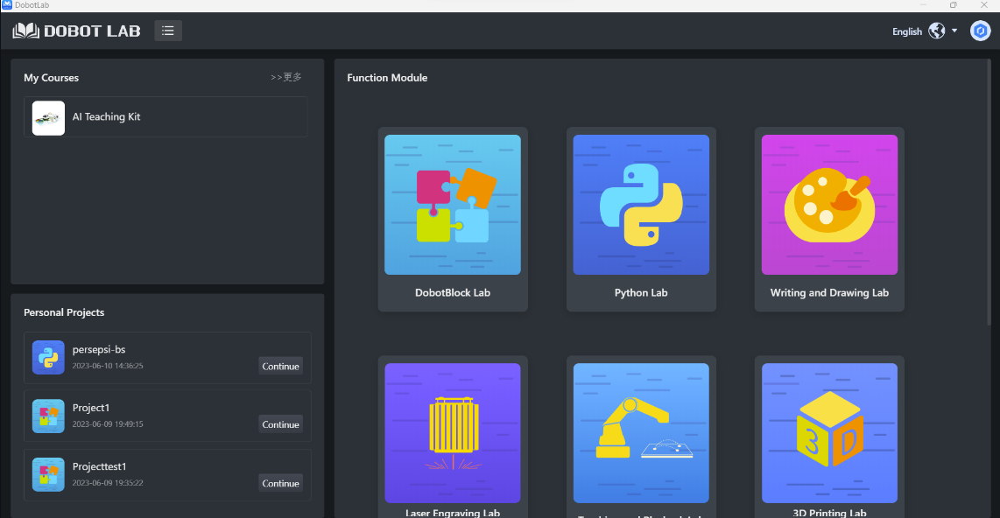
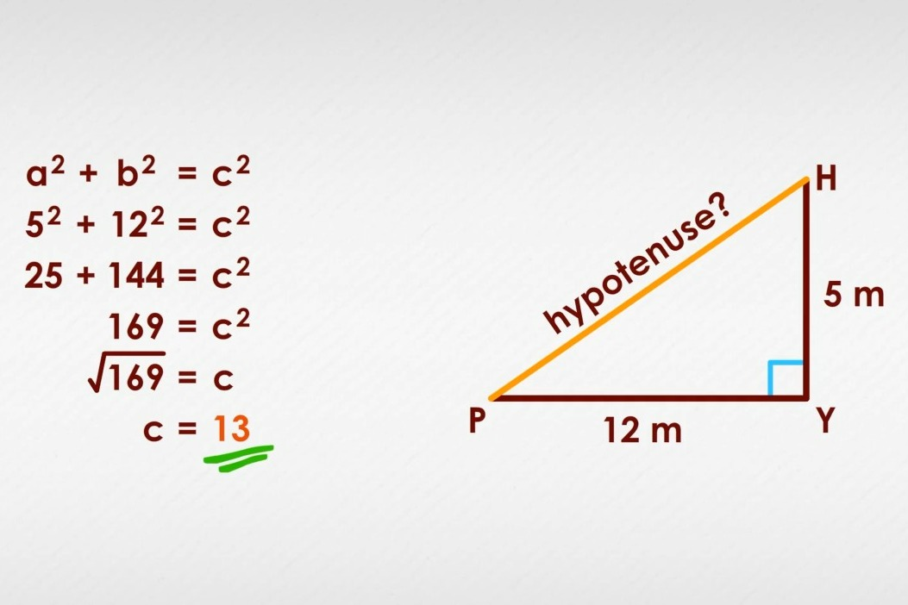
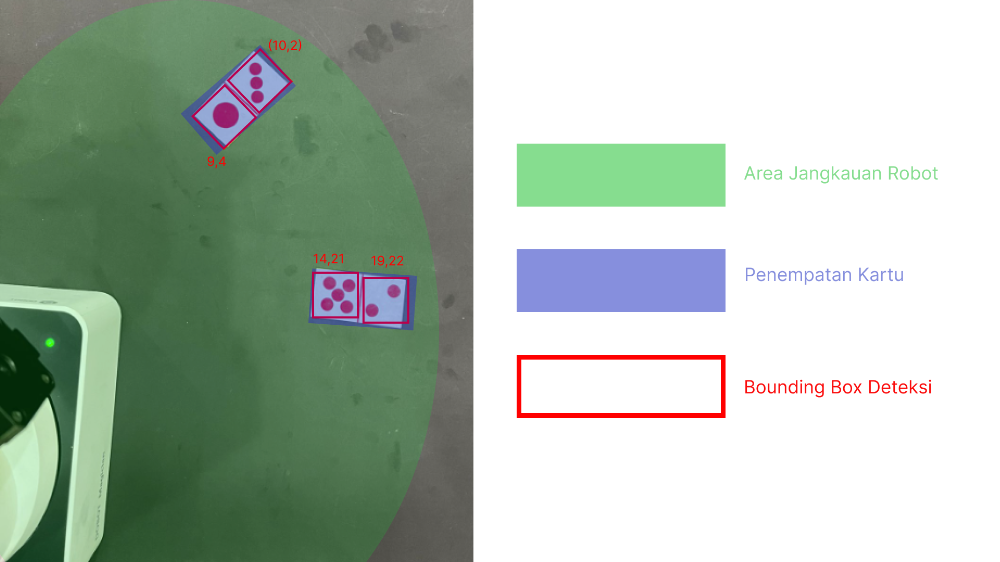
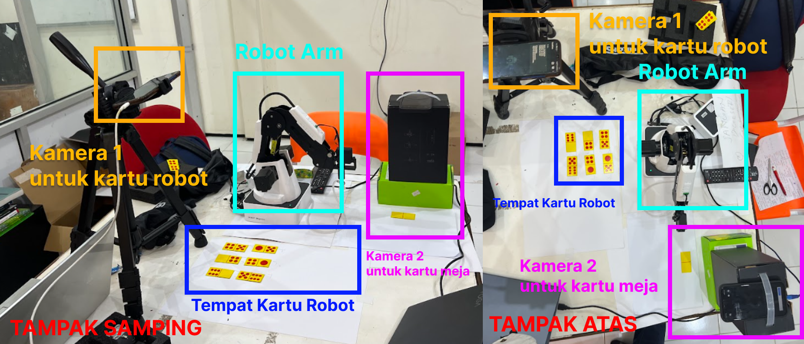

# domino-playing-robot

Implementasi Robot Arm (Dobot Magician) untuk Bermain Kartu Domino

Tujuan dari proyek ini adalah untuk mengimplementasikan robot arm (dobot magician) untuk bermain kartu domino dengan lawan pemain manusia dengan menggunakan visi komputer untuk melakukan deteksi objek (computer vision) pada kartu domino.

[DoBot Magician](https://www.dobot.cc/dobot-magician/product-overview.html) adalah sebuah robot lengan serbaguna yang dirancang untuk berbagai aplikasi. Robot ini dilengkapi dengan lengan robotik yang dapat bergerak dengan presisi tinggi dalam tiga sumbu. Selain itu, Dobot Magician juga memiliki kemampuan untuk mengganti end effector, seperti gripper (penggenggam) atau pen, sesuai dengan kebutuhan aplikasi. Fitur ini memungkinkan robot ini untuk melakukan berbagai tugas seperti pemindahan dan pengambilan objek, pemrograman robot, pencetakan 3D, dan pemrosesan otomatis dengan fleksibilitas yang tinggi.

[YOLOv8](https://docs.ultralytics.com/) adalah algoritma deteksi objek yang menggunakan jaringan saraf konvolusional (CNN) untuk memprediksi bounding box dan probabilitas kelas untuk setiap objek di dalam gambar. YOLO bekerja dengan membagi gambar menjadi grid berukuran SxS. Setiap sel grid bertanggung jawab untuk memprediksi objek yang ada di dalamnya, termasuk bounding box dan probabilitas kelas. Bounding box adalah kotak persegi panjang yang mendefinisikan lokasi dan ukuran objek. Probabilitas kelas adalah nilai yang menunjukkan kemungkinan suatu sel grid berisi objek dari kelas tertentu.

Dalam hal ini memfokuskan pengoperasian DoBot Magician melalui Python dengan  menggunakan [Dobot Lab](https://www.dobot-robots.com/products/education/magician.html). Menggunakan kode Python memberikan kebebasan yang lebih besar dalam mengontrol DoBot Magician, termasuk otomatisasi dan gerakan yang sangat terkalibrasi untuk tugas yang kompleks. 

## Daftar Isi
* [Memulai](#Memulai)
* [Keperluan](#Keperluan)
* [Panduan](#Panduan)
   * [Training](#Training)
   * [Kalibrasi](#Kalibrasi)
   * [Bermain](#Bermain)
* [Kode Akhir](#Kode-Akhir)


## Memulai

Untuk berkomunikasi dengan robot, kita memerlukan aplikasi [Dobot Lab](https://www.dobot-robots.com/products/education/magician.html). Selanjutnya pastikan kita juga menginstal 
[Python](https://www.python.org/) dan [OpenCV](https://opencv.org/) dalam lingkungan Python. Untuk IDE, kita dapat memanfaatkan menu Python Lab dalam aplikasi Dobot Lab.


## Keperluan

Hardware

- Komputer / Laptop
- Kamera (2 buah), disarankan tidak wide angle untuk menecgah distorsi
- Dobot Magician 

Software

- Python
- Ultralytics YOLOv8
- Dobot Lab

Perhatian: Untuk keperluan minimum software, harap untuk membaca dokumentasi masing - masing software.

## Panduan

Untuk memahami bagaimana alur kerja robot, mari kita bagi ke tiga bagian yaitu (training, kalibrasi posisi, dan bermain). 

## Training

Untuk bagian pertama adalah training yaitu bagaimana robot dapat mendeteksi kartu. Dalam hal ini kita memerlukan untuk mendeteksi kartu dan mengambil koordinat titik tengah dari bounding box. Dalam contoh di repo ini akan menggunakan model YOLOv8 dengan format "detect-model.pt". Jika menggunakan model tipe lain dapat, mengaturnya di bagian kode. Jika ingin menggunakan algoritma deteksi selain YOLOv8, dapat dilakukan asal dapat mengekstrak kelas deteksi dan koordinat titik tengah bounding box. Pada intinya, program harus menerima data deteksi dalam bentuk array kelas, array koordinat x dan array koordinat y. 

**Contoh Variable Penyimpan Hasil Deteksi**:
```python
detected_card = ["2", "1", ...]
x_card = [104.98, 93.61, ...]
y_card= [292.72, 249.02, ...]
```
Untuk bagian kedua adalah kalibrasi yaitu bagaimana robot dapat menentukan koordinat untuk mengambil kartu. Kita perlu mengingat bahwa koordinat yang terdeteksi mungkin saja tidak sama dengan koordinat internal robot. Misalkan pada koordinat kamera terdeteksi x,y = (10,25), pada nyatanya koordinat dalam koordinat internal robot adalah (39,75). Oleh karena itu kita perlu melakukan kalibrasi. untuk kalibrasi lakukan pengumpulan titik berdasarkan kamera dan jangkauan end effector robot. Misalkan dalam kasus ini, robot magician diberikan 6 kartu yang dapat diraih oleh end effector, Maka kita harus mengumpulkan data koordinat untuk 6 kartu tersebut (1 kartu domino mengandung 2 kelas objek, maka untuk 6 kartu terdapat 12 data).

**Contoh Variable Penyimpan Hasil Deteksi Untuk 1 Kartu (2 kelas terdeteksi)**:
| x_kamera | y_kamera | x_robot | y_robot |
|----------|----------|---------|---------|
| 120      | 225      | 175     | 200     |
| 135      | 200      | 175     | 200     |

Dapat dilihat di contoh diatas adalah data untuk satu kartu. Mengapa dua objek dengan koordinat kamera yang berbeda memiliki koordinat robot yang sama?. Ingat bahwa dalam kartu domino, setiap kartu memiliki 2 nilai (misal[2,3]). maka untuk memudahkan pekerjaan, kita hanya akan mengumpulkan data kalibrasi untuk setiap kartu. Maka 1 kartu yang terdeteksi 2 kelas akan memiliki koordinat akhir robot yang sama.

## Kalibrasi

**Lalu bagaimana kita dapat mengonversi koordinat kamera ke robot ?**

Pseudocode

```pseudocode
FUNGSI convert_coordinates(x, y):
    # Array dari koordinat baseline
    koordinat_kamera (x,y) = [(214, 261), (214, 313), (352, 252)], (426, 244), (430, 296)

    # Menghitung jarak dari koordinat input ke setiap baseline
    jarak = []
    UNTUK SETIAP koordinat_kamera DALAM koordinat_kamera:
        jarak = AKAR_KUADRAT((x - koordinat_kamera[0])^2 + (y - koordinat_kamera[1])^2)
        distances.TAMBAH(jarak)

    # Menemukan jarak terdekat
    indeks_terdekat = INDEKS_DARI(MIN(distances))

    # Mencocokkan indeks baseline terdekat dengan koordinat dunia nyata
    JIKA indeks_terdekat == 0 ATAU indeks_terdekat == 1:
        KEMBALI -60.12, -200.78
    SELAIN_ITU JIKA indeks_terdekat == 2 ATAU indeks_terdekat == 3:
        KEMBALI -66.49, -248.62
```

Python
```python
def convert_coordinates(x, y):
    # Array dari koordinat baseline
    baselines = [(214, 261), (214, 313), (352, 252), (331, 306)]

    # Menghitung jarak dari koordinat input ke setiap baseline
    distances = [np.sqrt((x - baseline[0])**2 + (y - baseline[1])**2) for baseline in baselines]

    # Menemukan indeks baseline terdekat
    closest_index = np.argmin(distances)

    # Mencocokkan indeks baseline terdekat dengan koordinat dunia nyata
    if closest_index in (0, 1):
        return -60.12, -200.78
    elif closest_index in (2, 3):
        return -66.49, -248.62
    elif closest_index in (..., ...):
        return ..., ...
```


Untuk memahami kode diatas mari ambil contoh bahwa satu kartu mempunyai dua kelas deteksi [1,2] mempunyai dua koordinat objek terdeteksi (x,y) = [(214,261), (214, 313)]. Dalam kode diatas kita ambil coba parameter x,y = (215,263). 

Perlu kita ketahui bahwa terkadang koordinat yang terdeteksi bounding box saat bermain terkadang tidak sesuai dengan koordinat kalibrasi. Misalkan kita letakkan kartu di posisi (12,24) berdasakan objek deteksi. Nyatanya saat bermain, koordinat bounding box bergeser sedikit menjadi (13,26). Jika kita menggunakan pernyatan IF-ELSE biasa maka kita tidak bisa melakukan konversi koordinat internal robot karena koordinatnya tidak akan sama. Oleh karena itu kita melakukan pendekatan. 

Jika ada koordinat kalibrasi (12,24), maka kita akan melakukan pendekatan titik mana yang terdekat dengan koordinat kalibrasi (12,24). Sekarang jika ada dua titik (13,26) dan (20,29), maka kita dapat dengan mudah titik pertama (13,26) adalah titik yang terdekat dengan koordinat kalibrasi (12,24)

Untuk melakukan ini kita akan menggunakan rumus sisi miring segitiga (hypotenuse untuk mencari jarak dari dua titik (titik kalibrasi dan titik kamera saat bermain)) dan kita akan simpan dalam array untuk setiap titik kalibrasi yang kita punya. Tambahkan ELSE-IF sesuai dengan titik yang dimiliki



Dalam melakukan kalibrasi ada beberapa hal yang perlu diperhatikan:

- Pastikan kamera menghadap ke bawah sebisa mungkin tegak lurus dengan bidang permukaan meja bermain untuk menghindari distorsi gambar.
- Pastikan kamera menangkap gambar kartu domino dengan baik dan pencahayaan yang cukup.
- Pastikan hanya melakukan pengumpulan data kalibrasi sesuai dengan jangkauan robot dan kamera menangkap gambar sesuai jangkauan robot (jangan terlalu dekat).



## Bermain

Untuk bermain ada beberapa langkah yang harus dilakukan. Pertama mengatur lingkungan bermain robot agar kondusif dan dapat mengangkap gambar. Berikut ini adalah salah satu konfigurasi lingkungan robot. 



Perhatian: Disarankan untuk melakukan set up lingkungan saat melakukan kalibrasi dan TETAP menjaga letak kamera dan robot. Jika sedikit saja robot / kamera bergeser, maka kalibrasi harus dilakukan ulang.

Selanjutnya mari kita membahas fungsi sederhana dalam program utama.

Pseudocode
```pseudocode
def convert_coordinates(x, y):
{       
    Mengambil inputan koordinat x,y dari hasil deteksi kamera kemudian mengembalikan hasil konversi ke koordinat robot sesuai titik kalibrasi. Misal dalam kamera titik (0,3) namun dalam koordinat robot adalah (12,15).
}

def capture_card_robot:
{       
    Mengambil gambar dari webcam dan mendeteksi kartu robot. Hasil tangkapan akan disimpan ke dalam 3 array. Array pertama menyimpan kelas objek yang dideteksi. Array kedua menyimpan koordinat x. Array ketiga menyimpan koordinat y. Array merupakan variabel global
}

def capture_card_robot:
{       
    Mengambil gambar dari webcam dan mendeteksi kartu meja pemain. Hasil tangkapan akan disimpan ke dalam 1 array menyimpan kartu di meja; misalkan [1,2] (menandakan kartu yang ada dimeja yaitu 1 dan 2). Array merupakan variabel global
}

def pilih_kartu:
{       
    Memilih kartu berdasarkan kartu yang ada di meja pemain dan kartu yang ada dimiliki robot. Misalkan kartu di meja pemain sekarang [1,2] dan kartu yang dimiliki oleh robot yaitu [1,3,3,4,5], Maka robot akan mengambil kartu 1 (berdasarkan koordinat sebelumnya) dan meletakkan di bagian meja pemain. Jika tidak ada kartu maka robot akan skip ke giliran selanjutnya. 
}

```
Untuk mengakses kode proyek, silakan klik [Kode Bermain](./kode-utama.ipynb)

Untuk mengakses model YOLOv8, silakan klik [Model YOLOv8](./best-2.pt)

Untuk mengakses Artikel Ilmiah, silakan klik [Artikel Ilmiah](./laporan_ai_domino.pdf)

Untuk mengakses Video, silakan klik [Video Demo](https://drive.google.com/file/d/1lpIgz3T_ppl5UApVk7rqoeNV1MpFE2Zn/view?usp=drive_link)

## Kontributor

- [Aryaduta Putra Perkasa](https://www.linkedin.com/in/aryaduta-putra-perkasa/?originalSubdomain=id)
- [Moses Mannuel Paliyama](https://www.linkedin.com/in/moses-mannuel-paliyama-438267151?originalSubdomain=id)
- [Joel Napitupulu](https://www.linkedin.com/in/joel-napitupulu-649076220/?originalSubdomain=id)

<br />

*Dibuat oleh Kelompok 2 untuk Mata Kuliah Robotika Kreatif*

*Teknik Komputer ITS*

*2023*
